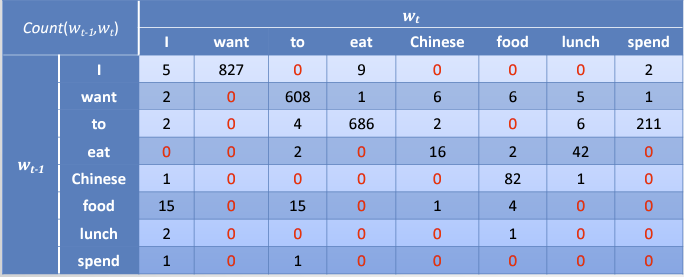
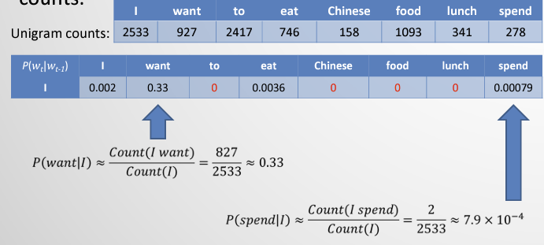
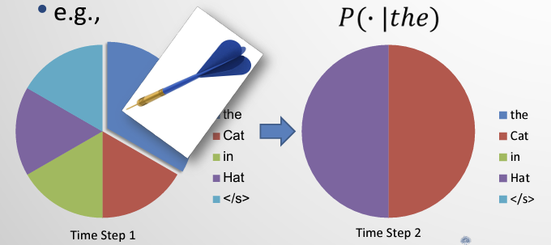
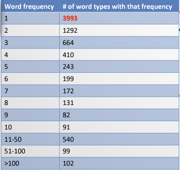
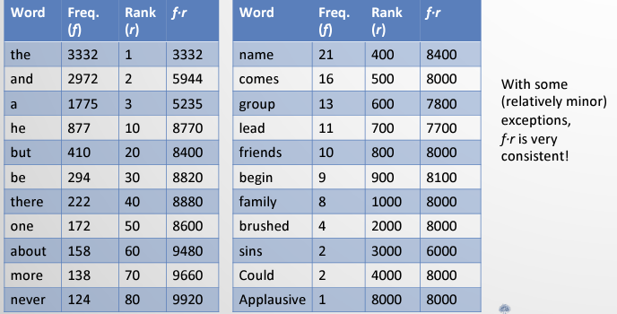
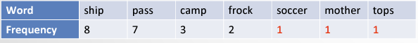
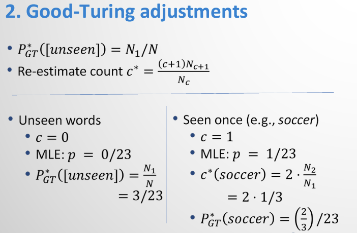
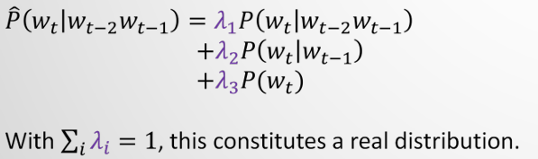

What are we counting? Tokens and types. Instances of words and kinds of words.

**Corpora:** A body of language data. Most useful when occurring naturally. Be aware of bias. 

**Vocabulary**: Set of unique Words

**Size of corpus**: Total number of words

### Word Order Matters!

Should consider past words, but not ALL past words. P(car|the\:old) = 0 may never appear in the corpus, but P(old|the) > 0 and P(car|old) > 0 could be true, \therefore P(the\:old\:car) > 0.

#### Solution: Word prediction with N-gram Models

**Language Models:** The statistical model of a language. Probability of words in an *ordered* sequence. i.e., P(w_1, w_2, ..., w_n).

**N-grams:** token sequences of length N

Given probabilities of N-grams, we can compute the conditional probabilities of possible subsequent words. Estimate P(w_t|w_{t-1}) from count of (w_{t-1}, w_t) in corpus. 

Example: 'the last word in this sentence is ___'. What is the next word? Suppose we know, 

P(is\:the) > P(is\:a) \therefore P(the|is) > P(a|is)

Then we would predict 'the last word in this sentence is **the**'.

**Term count (Count):** the number of tokens of term w in C

**Relative frequency (F_C):** relative to total number of tokens, basically the fraction of \frac{count}{total\:count}.

**Probabilistic Chain Rule:** P(A,B,C,D)=P(A)P(B|A)P(C|A,B)P(D|A,B,C)

But there are *many* possible solutions, how do we avoid 0 probabilities? We can make a Markov assumption, that only a short linear history of length L is sufficient for word prediction.

**Bigram** version: P(w_n|w_{1:(n-1)}) \approx P(w_n|w_{n-1})

### Bigram  Counts and Probabilities

To get likelihoods, we can dividing bigram counts by unigram counts. 

Now we can estimate the probability of **whole sentences** by adding the start (\<s\>) and end (\</s\>) tags.

P(<s> I\:want\:english\:food</s>) \approx

P(I|<s>)P(want|I)P(english|want)P(food|english)P(</s>|food) \approx 0.000031

#### Are N-grams still relevant?

Often cheaper to train/query than neural LMs. Can be interpolated with neural LMs to often achieve SOTA performance. *Occasionally* outperform neural LMs. Interpretable and convenient.

## Evaluation of Language Models

### Shannon's method

Sample based on context. RNG those darts. In general, Quadrigrams > Trigrams > Bigrams > Unigrams for appearing more similar to actual texts like Shakespeare. This is because for increasing context, there are fewer possible next words. E.g. P(Gloucester|seek\:the\:traitor) = 1.

### Goodness of a Model?

#### Extrinsic Evaluation

Utility of a language model is often determined *in situ* (in practice). Take two different LMs and compare them, such as for speech recognition.

#### Intrinsic Evaluation

Estimate the probability of a corpus P(C).

### Maximum Likelihood Estimate

\theta^* = \text{argmax}_{\theta}L_M(\theta | T), L_M(\theta|T) = P_{M(\theta)}(T), where T is the Brown corpus, M is the bigram and unigram tables, and parameters \theta_{to|want} \:\text{is}\: P(to|want).

### Perplexity

Sort of like a 'branching factor', PP(C) = 2^{-(\frac{log_2P(C)}{||C||})} = P(C)^{-1/||C||}

Minimizing perplexity \equiv Maximizing probability of corpus.

**Max perplexity**: Uniform corpus distribution

**Lower** perplexity \rightarrow **Better** Model. Trigram has lowest perplexity compared to bigram.

## Zipf and the Natural Distributions in Language

### Sparseness

Longer n-grams will result in more sparsity. Will result in probabilities of 0 when you do multiplications.

### Patterns of Unigrams

A few words occur **very frequently**.

#### Frequency of frequencies

#### Word Rankings

### Zipf's Law

<u>We humans are Nlazy.</u>

Speaker minimizes effort by having a **small** vocabulary of **common** words.

Hearer minimizes effort by having a **large** vocabulary of **less ambiguous** words.

Compromise: frequency and rank are inversely proportional.

f \propto \frac{I}{r} \quad \text{i.e., for some k} \quad f \cdot r = k

Zero prob in Shakespeare, some N-grams are just really rare

### Smoothing mechanisms

#### 1. Add-\delta smoothing (Laplace)

##### Laplace Smoothing (\delta = 1)

+1 imaginary count to all words, no more zero counts!

Laplace smoothing results in non-zero probabilities which is great, but now the rich n-grams have reduced probabilities. Inflation and taxes! Robinhood. Steal from the rich and give to the poor.

E.g. P(to|want) went from 0.66 to 0.26 :disappointed:. That's a huge change!

In **extrinsic** evaluations, the results are not great.

##### Generalized Laplace (\delta < 1)

Sometimes work empirically (e.g. text categorization), sometimes not.

#### 2. Good-Turing

**Idea**: We still want to get rid of zeros. But now we want re-estimate counts of words using the MLE of words that occur count + 1 times. We look to our word neighbors in terms of frequency to make new estimates. 

What is the probability of seeing something **new** (N_0)? Use the N_1 counts as an estimate. If N_{c+1} has a count of zero, we can use log-log linearly interpolation to guess. 

#### 3. Simple Interpolation

Combine trigram, bigram, and unigram probabilities.

#### 4. Absolute discounting

Instead of multiplying highest N-gram by a \lambda_i, we can just subtract a fixed discount 0 \leq \delta \leq 1 from each non-zero count. Both simple interpolation and absolute discounting redistribute probability mass, but for absolute discounting we have a similar trend observed when comparing counts of training set and held-out set.

#### 5. Kneser-Ney smoothing (Modified)

Use different absolute discounts depending on n-gram count. Lots of math that won't be tested, but Modified Kneser-Ney is arguably the **most popular choice** for n-gram language modelling.

