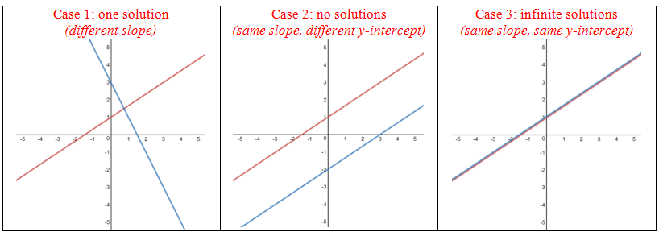

### Vectors and Matrices


a = \begin{bmatrix} 1\\ 2\\ 3\\ \end{bmatrix} \in \R^3,  A^{m \times n} = 
\begin{bmatrix}
   a_{11} & a_{12} & \cdots & a_{1n}\\
   a_{21} & a_{22} & \cdots & a_{2n}\\
   \vdots & \vdots & \ddots & \vdots \\
   a_{m1} & a_{m2} &  \cdots & a_{mn}
\end{bmatrix}


### Matrix  Operations and Properties

#### Addition

The sum of two matrices A \in \R^{m \times n}, B \in \R^{m \times n} is defined as the element-wise sum, i.e.,

A+B:= 
\begin{bmatrix}
   a_{11} + b_{11} & \cdots & a_{1n} + b_{1n}\\
   \vdots &  & \vdots\\
   a_{m1} + b_{m1} &  \cdots & a_{mn} + b_{mn}
\end{bmatrix} \in \R^{m \times n}

#### Multiplication

Only if neighbouring dimensions match.

\underbrace{A}_{n \times k} \underbrace{B}_{k \times m} = \underbrace{C}_{n \times m}

#### Identity

I_{n} := 
\begin{bmatrix}
   1 & 0 & \cdots & 0\\
   0 & 1 & \cdots & 0\\
   \vdots & \vdots & \ddots & \vdots \\
   0 & 0 &  \cdots & 1
\end{bmatrix} \in \R^{n \times n}

#### Properties

- *Associativity*:

  ​	\forall A \in \R^{m \times n}, B \in \R^{n \times p}, C \in \R^{p \times q}: (AB)C = A(BC)

  ​	For scalar multiplication, can move scalar values around anywhere.

- *Distributivity*:

  ​	\forall A, B \in \R^{m \times n}, C, D \in \R^{n \times p}: (A + B)C = AC + BC

  ​														   A(C + D) = AC + AD

  ​	Same scalar distributivity as real numbers.

- Multiplication with the identity matrix:

  ​	\forall A \in \R^{m \times n}: I_m A = AI_n = A

  Note that I_m \neq I_n for m \neq n

### Systems of Linear Equations

##### Solution Space

1. One solution: Equations are linearly independent, # unknowns = # equations
2. No solution: Some combination of equations contradicts another equation
3. Infinite solutions: Equations are linearly dependent

##### Solving Linear Systems

-   Row-echelon decomposition

##### Linear Independence

First defining a linear combination. Consider a vector space V and a finite number of vectors x_1, ...,x_k \in V. Then, every v \in V of the form 

v=\lambda_1 x_1 + \cdots + \lambda_k x_k = \sum_{i = 1}^k \lambda_i x_i \in V

with \lambda_1, ..., \lambda_k \in \R is a <u>*linear combination*</u> of the vectors x_1, ..., x_k.

Consider the same vector space V. If there is a non-trivial linear combination, such that 0 = \sum_{i=1}^k \lambda_i x_i with at least one \lambda_i \neq 0, the vectors x_1, ...,x_k are *<u>linearly dependent</u>*. Otherwise, if the only solution is the trivial solution \lambda_1 = ... = \lambda_k = 0 the vectors <u>*linearly independent*</u>.

##### Convex Combination

Non-negative \lambda_i such that \sum_{i=1}^n \lambda_i = 1.

