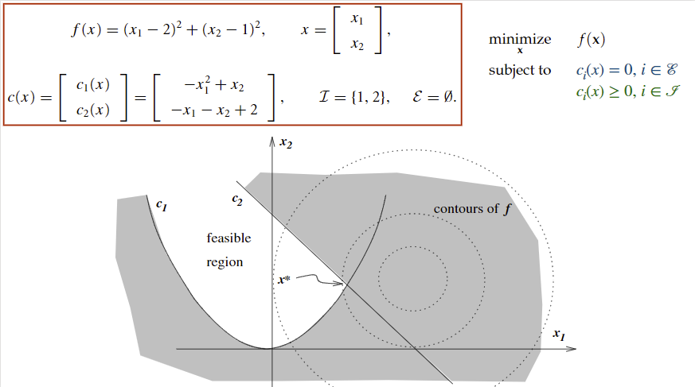

### General Optimization

\underset{x}{\text{minimize}}\: f(x)

\text{subject to} \quad c_i(x) = 0, i \in \mathcal{E}

​                     c_i(x) \geq 0, i \in \mathcal{J}

for Variables x, Objective Function f(x) that satisfies f: \mathbb{R}^n \rightarrow \mathbb{R}, Constraints \mathcal{E}, \mathcal{J} Here's a quick example.

Notice we don't use strictly greater than. Why? In a continuous domain it is not well-defined. There is no solution to the following optimization as you can get infinitely close to 1, but there is always some \delta that can be subtracted to get you even closer. 

\underset{x}{\text{minimize}}\: f(x),\quad \text{subject to} \: x > 1

Less than or equal to constraints can be converted to greater than or equal to by multiplying the constraint by -1.

### Continuous vs. Discrete

Which is typically easier, continuous or discrete optimization?

An initial guess might be "Oh, discrete cases means limited combinations, so it must be easier right?". Well it turns out that enumeration doesn't get any better as the parameter space increases. I like to think of it as trying to get to the bottom of a hill using stairs (discrete steps) vs. sliding down on a toboggan (continuous). <u>Sorting</u> is an example where discrete optimization is great, and there are methods that aren't just pure enumeration, but that will be for another time.

### Critical Points

**Global min**: lowest point in entire parameter space

**Weak local min**: \leq than points in a small neighborhood around it

**Strong local min**: \lt than points in a small neighborhood around it. $f'(x
^{*}) = 0, f''(x^{*}) > 0$.

**Inflection**: Point where rate of change *of the* rate of change changes signs (convex to concave or vice versa). For this course, when \frac{dy}{dx} = \frac{d^2y}{dx^2} = 0.

## Conditions for Local Optimality

1. $f'(x^*) = 0$, the first-order necessary condition (FONC)
2. $f''(x^{**}) \geq 0$, the second-order necessary condition (SONC)

Note: Not all points with zero derivative and a zero second derivative are local minima, such an inflection point.

### How did we get the necessary conditions?

A *Taylor approximation* that uses only the <u>first two terms</u> of the Taylor expansion.

### Proof of the FONC

**Theorem:** if $x^*$ is a local minimizer and f is continuously differentiable around $x^*$, then $f'(x^*) = 0$.

> **Proof**
>
> Put the proof here

# Continue with Bisection Algorithm and runtimes.

