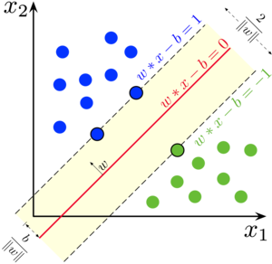

## Introduction and Motivation

Humans learn to design algorithms.

Can algorithms *learn* to design algorithms? This is the domain of <u>machine learning</u> and <u>discrete optimization</u>. Some applications include: data center management, energy systems, scientific discovery, ridesharing, scheduling, disaster response, college admissions, and so on.

> "[...] the overall value of linear optimization to the economy probably surpasses 5% overall or more than $1 trillion each year in the United States alone."  - Birge, J. R. (2022)



Given Services S with varying CPU and Memory demands and Machines M, how would you design a job scheduler?

Each machine has multiple processors, so ideally we would want the minimum number of machines active while servicing all the jobs. Each service is on one machine only, and machine is "ON" if a job is assigned to it. Machines should have enough memory and CPU capacity to run all the services. With our variables, metrics, and constraints defined; we now have an optimization problem. Rewriting in mathematical notation:



| Variables                                                    | Metrics                                                    | Constraints                                                  |
| ------------------------------------------------------------ | ---------------------------------------------------------- | ------------------------------------------------------------ |
| y_m = 1 if machine <b><i>m</i></b> is used  x_{s,m} = 1 if service <b><i>s</i></b> runs on <b><i>m</i></b>   x \in \{0,1\}^{S \times M}, y \in \{0,1\}^M | **minimize** \sum_{m=1}^{M} y_m | \sum_{m=1}^M x_{s,m} =1 \: \forall s y_m \geq x_{s,m} \: \forall s,m \sum_{s=1}^S \mathbf{mem}(s) \cdot x_{s,m} \leq \mathbf{MEMCAP}(m) \: \forall m \sum_{s=1}^S \mathbf{cpu}(s) \cdot x_{s,m} \leq \mathbf{CPUCAP}(m) \: \forall m  |

#### Artificial Intelligence

Performs **non-trivial tasks** as well as or better than humans. Many sub-goals including Perception, Reasoning, Control, and Planning.

E.g. <u>Speech Recognition:</u> Perception + Reasoning

<u>Autonomous Driving:</u> Perception + Reasoning + Control + Planning

<u>Game Playing:</u> Reasoning + Planning

#### Knowledge-Based AI

Knowledge is represented via logic. We have a knowledge base (set of formulae) and models where all these facts hold. Easy to interpret.

Fundamental Limitations: cannot perform better than human, requires domain knowledge, some things we can't explain to a computer (riding a bicycle)

#### Data-Based AI = Machine Learning

Pros: Don't need to learn from humans, performance improves with more examples

Cons: Hard to interpret, may need **many** examples

> <u>Machine Learning</u>
>
> Study of algorithms that
>
> - improve their <u>performance</u> P (Optimization)
> - at some <u>task</u> T (Classification, Regression, Clustering)
> - with <u>experience</u> E (Images, Text, Numbers)
>
> well-defined learning task: <P,T,E>

#### Supervised Learning

With sufficient amount of "similar" data and an expressive model class, minimizing the loss function on the training data should yield an **accurate model** on **unseen test data**.

##### Classification Elements

1. Data, Model, Loss 

Decision Tree predict **discrete** outcomes, LR predicts **probabilities** of outcomes.

##### Decision Trees

1. Find **best attribute** to split on (e.g. humidity level)
2. Find **best split** on chosen attribute (e.g. <> 80%)
3. Repeat 1 & 2 until **stopping criterion** is met (very few data points; node is pure(most training data in node have same label))

##### Logistic Regression (LR)

Parameters: \beta_0, \beta_1, ..., \beta_d

Model: p(x;\beta) = \frac{1}{1 + e^{-(\beta_0 + \beta_1 x_1 + ... + \beta_d x_d)}}

Data: S = {(x_i, y_i)}_{i=1,...,n} , x_i: example with d attributes, y_i: label

Optimization: Use Maximum likelihood Estimation (MLE) to find parameters \beta^* that maximizes the likelihood: \prod_{i=1}^{n} p(x_i;\beta)^{y_i} \times (1 - p(x_i;\beta))^{1-y_i}

##### Support Vector Machines (SVM)

I love them. Uses the **Maximum-Margin** Principle so that its robust to outliers.

